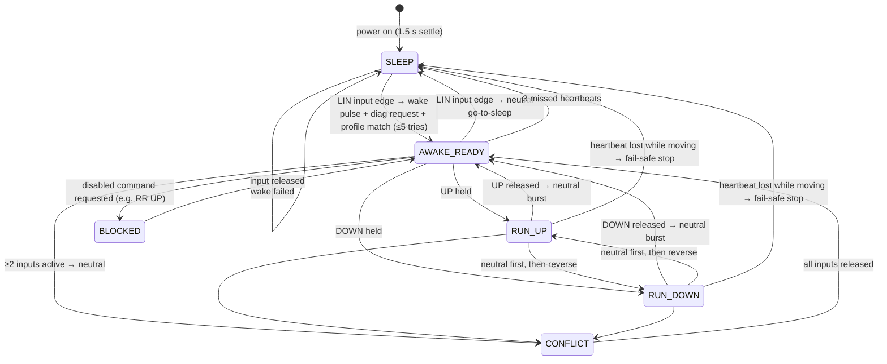

# Firmware Architecture

> **Note:** The source code for this project is kept in a private repository. File paths below refer to that repository. Access is [available on request](https://github.com/dhanushanand-dev).

This page describes the latest firmware: `firmware/stm32_nucleo_f446re_project/Core/Src/main.c`, the "Generic LIN BCM Controller v4: PLC hold-to-run".

## Layers

```
┌──────────────────────────────────────────────────────────┐
│ Application: PLC_HoldToRun_ControlLoop()                 │  state machine, interlocks, heartbeat
├──────────────────────────────────────────────────────────┤
│ ECU services                                             │  ECU_WakeSequence / ECU_SleepSequence
│                                                          │  LIN_AutoDetectConnectedECU / LIN_ReadStatus
│                                                          │  LIN_SendCommandPayload / LIN_SendNeutralBurst
├──────────────────────────────────────────────────────────┤
│ LIN driver                                               │  LIN_SendFrameEx, LIN_ProbeID, LIN_CalcPID,
│                                                          │  LIN_CalcChecksum, LIN_SendWakeupPulse
├──────────────────────────────────────────────────────────┤
│ STM32 HAL: USART1 in LIN mode, USART2 debug, GPIO        │
└──────────────────────────────────────────────────────────┘
```

## LIN driver

| Function | What it does |
|---|---|
| `LIN_SetBaudRate()` | Re-initialises USART1 with `HAL_LIN_Init` and 10-bit break detection. |
| `LIN_CalcPID()` | Adds the two LIN parity bits to the 6-bit ID. |
| `LIN_CalcChecksum()` | Inverted sum with carry wrap-around. Classic covers the data only; enhanced covers the PID plus the data. |
| `LIN_SendFrameEx()` | Master-published frame: break (`USART_CR1_SBK`), `0x55`, PID, data, checksum. The receiver is disabled while sending so the master doesn't read back its own echo. |
| `LIN_ProbeID()` | Header only. It then waits up to 20 ms for the first byte of the slave's reply and 4 ms between later bytes. |
| `LIN_SendWakeupPulse()` | Sends a break as the bus wake-up signal, then waits 100 ms. |

## Door profiles (data-driven design)

```c
typedef struct {
    const char *side_name;          // "FL", "FR", "RL", "RR"
    uint8_t status_id;              // 0x16..0x19
    uint8_t command_id;             // 0x15
    uint8_t diag_resp[9];           // expected 0x3D reply → identifies the door
    uint8_t baseline_status[9];     // idle status frame
    MotorCommand manual_up;         // name, enabled flag, 8-byte payload
    MotorCommand manual_down;
} MotorProfile;
```

To support a new ECU you add one entry to `MOTOR_PROFILES[]`. The control logic doesn't change.

## State machine



## Safety and robustness

| Mechanism | Detail |
|---|---|
| Hold-to-run | The motor command repeats every 50 ms **only while the input is held**. On release, a neutral burst is sent: 5 × `FF…FF`, 30 ms apart. |
| Debounce | Every input must stay stable for 20 ms. The control loop runs every 5 ms. |
| Edge-triggered wake/sleep | The LIN input acts only on its OFF→ON edge. A PLC output left ON won't toggle the ECU repeatedly. |
| Two-input interlock | UP+DOWN, LIN+UP or LIN+DOWN causes an immediate neutral. All inputs must be released before the controller re-arms. |
| Direction-change dead time | Reversing the direction always sends the neutral burst first. |
| Disabled commands | `MotorCommand.enabled = 0` blocks payloads that haven't been verified (RR UP). |
| Heartbeat | The status frame is read every 1 s while awake. It is checked for length and a valid enhanced checksum. |
| Fail-safe stop | If the heartbeat fails while the motor is moving, the firmware sends neutral at once and returns to SLEEP. |
| Loss of communication | Three missed heartbeats while idle send the controller back to SLEEP. A later LIN press re-runs wake and auto-detect. |
| Wake retry | 5 attempts, 300 ms apart. |

## I/O map

| Signal | STM32 pin | Nucleo header | Notes |
|---|---|---|---|
| LIN TX (USART1_TX) | PA9 | D8 | → transceiver RX/TXD |
| LIN RX (USART1_RX) | PA10 | D2 | ← transceiver TX/RXD |
| Debug console (USART2) | PA2 / PA3 | via ST-Link USB | 115200 8N1 |
| LIN_BUTTON (wake/sleep) | PC7 | D9 | Input with pull-up, active LOW |
| UP_BUTTON | PB6 | D10 | Input with pull-up, active LOW |
| DOWN_BUTTON | PA7 | D11 | Input with pull-up, active LOW |
| LIN status LED | PA6 | D12 | Blinks while asleep, solid while awake |
| UP status LED | PB9 | D14 | On while moving up |
| DOWN status LED | PB8 | D15 | On while moving down |

The CubeMX configuration (`code_files.ioc`) also defines `RELAY_UP/DOWN` (PB5/PB4) and `TOP/BOT_SENSOR` pins. They are left over from earlier experiments and the v4 firmware doesn't use them.

## Clock

The clock source is HSI 16 MHz into the PLL (M=8, N=180, P=2), giving **SYSCLK 180 MHz**. Over-drive is enabled, APB1 = 45 MHz and APB2 = 90 MHz.
